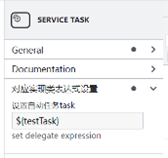
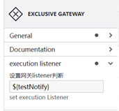
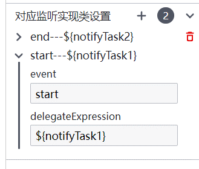

# huiluczp-activiti-properties-panel-extension
simple properties panel extension based on bpmnjs

### 实现三个简单的bpmnjs拓展需求:</br>
1. 在ServiceTask标签中增加delegate expression属性，使其能设置对应的task实现类。
2. 在ExclusiveGateway标签中增加子标签```<activiti:executionListener>```，标签中内容为状态监听实现类，标签唯一。
在ExclusiveGateway标签的extensionElements标签中增加子标签
3. ```<activiti:executionListener>```子标签，可增加复数子标签。子标签中包含event属性和delegateExpression属性可进行设置，并实现name属性的自动生成。event属性默认设为start。

主要的修改在app中，index.js与index.html为默认主页相关。

### 效果展示




### 使用方式：
```
npm install
npm start
```

### 更详细的说明请看：</br>
[bpmnjs Properties-panel拓展（属性设置篇）](https://blog.csdn.net/qq_41733192/article/details/132539449?spm=1001.2014.3001.5501)</br>
[bpmnjs Properties-panel拓展（ExtensionElements篇）](https://blog.csdn.net/qq_41733192/article/details/132555735?spm=1001.2014.3001.5502)</br>
